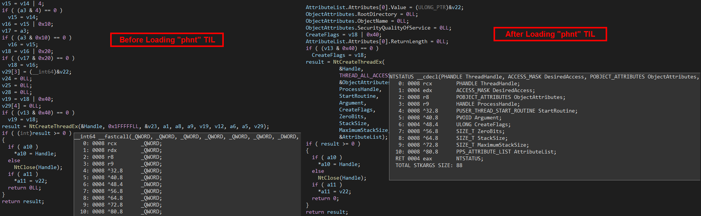

# IDA_PHNT_TYPES
Converted phnt (Native API header files from the System Informer project) to IDA TIL, IDC (Hex-Rays). 
To import "phnt" types and function definitions to IDA and help with Reverse Engineering. 

## Using
- Windows 11 SDK 10.0.22621.0 
- Latest phnt (08-23-2024) 
- PHNT_VERSION PHNT_WIN11 // Windows 11 - To get latest types 
- IDA Tools: idaclang84, tilib84 
 

## Generated Converted Output
### IDA IDC "phnt" Type Information Scripts
- **Files:** phnt_win11.idc, phnt64_win11.idc 
- **Contains:** phnt types, no function definitions 
- **Usage:** In IDA, execute the *.idc script file and types should be imported - check the "Local Types" window. 

### IDA TIL "phnt" Type Information Libraries
- **Files:** phnt_win11.til, phnt64_win11.til 
- **Contains:** phnt types + function definitions 
- **Usage:**  
Copy *.til files to your "IDA Instalation Dir\til\pc", e.g., "C:\Program Files\IDA Pro 8.4\til\pc". 
In IDA, go to "Type Libraries" window and load the appropriate *.til type library. 
 

## Compilation Commands
Make sure that the appropriate version of Windows SDK (Windows 11 SDK) is installed (use Visual Studio installer). 
Copy idaclang.exe to your "IDA Instalation Dir", e.g., "C:\Program Files\IDA Pro 8.4". 

### To generate IDA TIL "phnt" Type Information Libraries:
**phnt_win11.til:**  
`.\idaclang.exe -target i386-pc-win32 -x c++ -I"C:\Users\User\Desktop\IDA_PHNT_TYPES\phnt" --idaclang-tildesc "PHNT Native API Header Files (Windows 11)" --idaclang-tilname "phnt_win11.til" phnt_include.h` 

**phnt64_win11.til:**  
`.\idaclang.exe -target x86_64-pc-win32 -x c++ -I"C:\Users\User\Desktop\IDA_PHNT_TYPES\phnt" --idaclang-tildesc "PHNT Native API Header Files (Windows 11 x64)" --idaclang-tilname "phnt64_win11.til" phnt_include.h` 

**Check types in TIL:**  
Copy tilib64.exe to your "IDA Instalation Dir", e.g., "C:\Program Files\IDA Pro 8.4". 
`.\tilib64.exe -l .\phnt_win11.til` 
`.\tilib64.exe -l .\phnt64_win11.til` 
 

### To generate IDA IDC "phnt" Type Information Scripts:
Very similar like above but using the IDA UI, setting the Options->Compiler (Source parser=clang, target, included directories). 
`IDA-> Load File-> Parse C header file` (phnt_include.h) 
`IDA-> Produce file -> Dump typeinfo to IDC file` 
 

## BEFORE vs. AFTER

 

## License
**NO** :grin: 
 
  

## Reference
- [phnt - Native API header files for the System Informer project](https://github.com/winsiderss/phnt) 
- [IDA](https://hex-rays.com/) 
- [IDA idaclang tutorial](https://hex-rays.com/tutorials/idaclang/idaclang_tutorial.pdf) 
- [IDA idaclang example](https://blog.nviso.eu/2023/11/07/generating-ida-type-information-libraries-from-windows-type-libraries/) 
